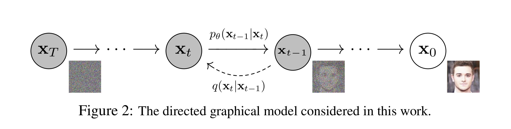
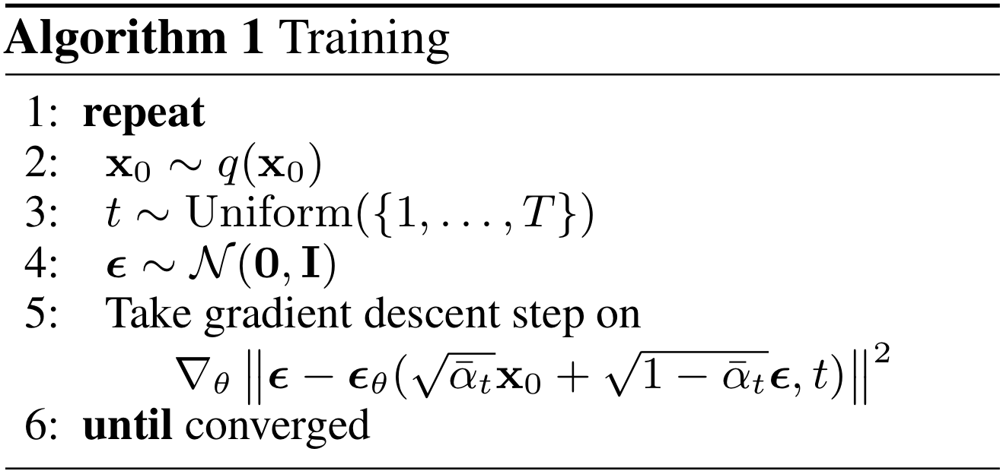
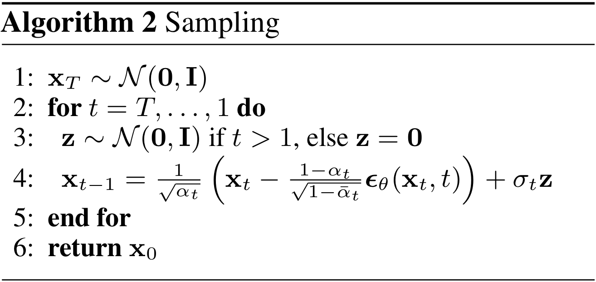
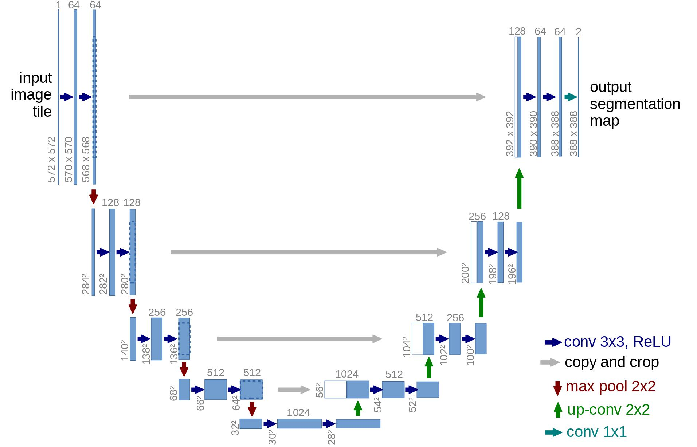

# diffusion-from-scratch

> A diffusion probabilistic model (which we will call a “diffusion model” for brevity) is a parameterized Markov chain trained using variational inference to produce samples matching the data after finite time. Transitions of this chain are learned to reverse a diffusion process, which is a Markov chain that gradually adds noise to the data in the opposite direction of sampling until signal is destroyed. When the diffusion consists of small amounts of Gaussian noise, it is sufficient to set the sampling chain transitions to conditional Gaussians too, allowing for a particularly simple neural network parameterization

  

## What is a diffusion model?

A (denoising) diffusion model isn't that complex if you compare it to other generative models such as Normalizing Flows, GANs or VAEs: they all convert noise from some simple distribution to a data sample. This is also the case here where **a neural network learns to gradually denoise data** starting from pure noise.

In a bit more detail for images, the set-up consists of 2 processes:

- a fixed (or predefined) forward diffusion process 𝑞 of our choosing, that gradually adds Gaussian noise to an image, until you end up with pure noise
- a learned reverse denoising diffusion process 𝑝𝜃, where a neural network is trained to gradually denoise an image starting from pure noise, until you end up with an actual image.

Both the forward and reverse process indexed by 𝑡 happen for some number of finite time steps 𝑇 (the DDPM authors use 𝑇=1000). You start with 𝑡=0 where you sample a real image 𝐱0 from your data distribution (let's say an image of a cat from ImageNet), and the forward process samples some noise from a Gaussian distribution at each time step 𝑡, which is added to the image of the previous time step. Given a sufficiently large 𝑇 and a well behaved schedule for adding noise at each time step, you end up with what is called an isotropic Gaussian distribution at 𝑡=𝑇 via a gradual process.

In other words:

- we take a random sample 𝐱0 from the real unknown and possibily complex data distribution 𝑞(𝐱0)
- we sample a noise level 𝑡 uniformally between 1 and 𝑇 (i.e., a random time step)
- we sample some noise from a Gaussian distribution and corrupt the input by this noise at level 𝑡 using the nice property defined above
- the neural network is trained to predict this noise based on the corruped image 𝐱𝑡, i.e. noise applied on 𝐱0 based on known schedule 𝛽𝑡

In reality, all of this is done on batches of data as one uses stochastic gradient descent to optimize neural networks.

## The neural network

The neural network needs to take in a noised image at a particular time step and return the predicted noise. Note that the predicted noise is a tensor that has the same size/resolution as the input image. So technically, the network takes in and outputs tensors of the same shape. What type of neural network can we use for this?

What is typically used here is very similar to that of an [Autoencoder](https://en.wikipedia.org/wiki/Autoencoder) which you may remember from typical "intro to deep learning" tutorials. Autoencoders have a so-called "bottleneck" layer in between the encoder and decoder. The encoder first encodes an image into a smaller hidden representation called the "bottleneck", and the decoder then decodes that hidden representation back into an actual image. This forces the network to only keep the most important information in the bottleneck layer.

In terms of architecture, the DDPM authors went for a **U-Net**, introduced by ([Ronneberger et al., 2015](https://arxiv.org/abs/1505.04597)) (which, at the time, achieved state-of-the-art results for medical image segmentation). This network, like any autoencoder, consists of a bottleneck in the middle that makes sure the network learns only the most important information. Importantly, it introduced residual connections between the encoder and decoder, greatly improving gradient flow (inspired by ResNet in [He et al., 2015](https://arxiv.org/abs/1512.03385)).

As can be seen, a U-Net model first downsamples the input (i.e. makes the input smaller in terms of spatial resolution), after which upsampling is performed.

### Deep Unsupervised Learning using Nonequilibrium Thermodynamics
> https://arxiv.org/abs/1503.03585
>> (2015 paper which originally introduced this technique coming from statistical physics)

- A central problem in machine learning involves modeling complex data-sets using highly flexible families of probability distributions in which learning, sampling, inference, and evaluation are still analytically or computationally tractable. Here, we develop an approach that simultaneously achieves both flexibility and tractability. ==**The essential idea, inspired by non-equilibrium statistical physics, is to systematically and slowly destroy structure in a data distribution through an iterative forward diffusion process. We then learn a reverse diffusion process that restores structure in data, yielding a highly flexible and tractable generative model of the data==.** This approach allows us to rapidly learn, sample from, and evaluate probabilities in deep generative models with thousands of layers or time steps, as well as to compute conditional and posterior probabilities under the learned model.

- This paper decided to sample the noise from normal distribution and that hasn't been changed since

### Denoising Diffusion Probabilistic Models 
> https://arxiv.org/abs/2006.11239
>> (Second influential paper for diffusion models published in 2020 which introduced few groundbreaking changes which led to huge jump in quality)

- This paper laid out three things the network in the reverse process could predict 
1. predicting the mean of the noise at each time step 
2. predicting the original image directly
3. predicting the noise in the image directly which could then just be subtracted from the noise image to get a little bit less noised image 

Second option won't work well as was shown in the original paper, prediciting in steps is more tractable("Estimating small perturbations is more tractable than explicitly describing the full distribution with a single, non-analytically-normalizable, potential function. Furthermore, since a diffusion process exists for any smooth target distribution, this method can capture data distributions of arbitrary form")

First and the third option are the same, just parametrized differently and all authors decided to go with the third option and predict the noise directly

You may be wondering why do we just predict the mean and not the variance in the first option, after all a normal distribution needs both mean and variance - well the authors of the 2020 paper decided to fix the variance and thus there is no need to predict it since it's always readily available

### Improved Denoising Diffusion Probabilistic Models
> https://arxiv.org/abs/2102.09672
>> OpenAI's first paper on diffusion models with major improvements

- The choice of fixing the variance was rethought by the OpenAI authors in their first paper and they eventually decided to learn the variance too because it would lead to improvements in the log likelihoods

- Also one more thing to note is that we don't employ the same amount of noise at each time step in the forward process. this is being regulated by a schedule which scales the mean and the variance which ensures that the variance doesn't explode as we add more and more noise 

- The paper from 2020 employed a linear schedule which authors from openai found to be sub-optimal especially at the end of the noising process because you see that the last couple of time steps already seem like complete noise and might be redundant

- Also they found that the information would be destroyed too fast with a linear schedule and as a result they created their own called the cosine schedule

- The cosine schedule destroys the information more slowly and solves both problems of the linear schedule which is too rapid in destroying the information and to uninformative at the end

### Architecture

- The authors from the 2020 paper went with a U-Net like architecture

- This kind of architecture has a bottleneck in the middle, it takes an image as input and using downsample and ResNet blocks it projects the image to a small resolution and after the bottleneck it projects it back up to the original size using upsample blocks this time 
- Also at certain resolutions the authors put in attention blocks and employed skip connections between layers of the same spatial resolutions 
- The model will always be designed for each time step and the way of telling the model at which time step we are is done using the sinusoidal position embeddings from the transformer paper. This embedding is projected into each residual block. This is important because the forward diffusion process is using a schedule which scales the mean and the variance and as a result different amount of noise is applied at different time steps and with this positional information the model can also take care of removing different amount of noise at different time steps which greatly benefits the outcome

### Diffusion Models Beat GANs on Image Synthesis
> https://arxiv.org/abs/2105.05233
>> OpenAI's second paper on diffusion models with major improvements

- In this paper from, the authors from OpenAI heavily improved the overall outcome by improving the architecture 
- They made the following updates:
1. increased the depth of the network
2. decreased the width 
3. more attention blocks than the original proposal
4. increased the number of attention heads 
5. they also took the residual blocks from BigGan and used this for the upsampling and down sampling blocks 
6. proposed Adaptive Group Normalization
7. Classifier Guidance (uses a separate classifier to help the diffusion model to generate a certain classes)

Adaptive Group Normalization is just a fancy name for the idea of incorporating the time step slightly differently and additionally also the class label. They first apply a group norm after the first convolution in each ResNet block and multiply this by a linear projection of the time step and add a linear projection of the class label onto it

### Brief summary 

- We have two processes - one for going from a normal image to complete noise which follows a normal distribution and then we have a reverse process going from complete noise to a real looking image using a neural network 
- Both processes are done iteratively and the architecture of the model follows a U-Net

### Refrences:
- https://arxiv.org/abs/1503.03585
- https://arxiv.org/abs/2006.11239
- https://arxiv.org/pdf/2102.09672
- https://arxiv.org/pdf/2105.05233
- https://github.com/huggingface/blog/blob/main/annotated-diffusion.md
- https://lilianweng.github.io/posts/2021-07-11-diffusion-models/
- https://www.assemblyai.com/blog/diffusion-models-for-machine-learning-introduction/
- https://www.chenyang.co/diffusion.html
- https://github.com/diff-usion/Awesome-Diffusion-Models
- https://nonint.com/2022/10/31/grokking-diffusion-models
- https://www.youtube.com/watch?v=I1sPXkm2NH4
- https://www.youtube.com/watch?v=a4Yfz2FxXiY
- https://www.youtube.com/watch?v=HoKDTa5jHvg
- https://www.youtube.com/watch?v=TBCRlnwJtZU